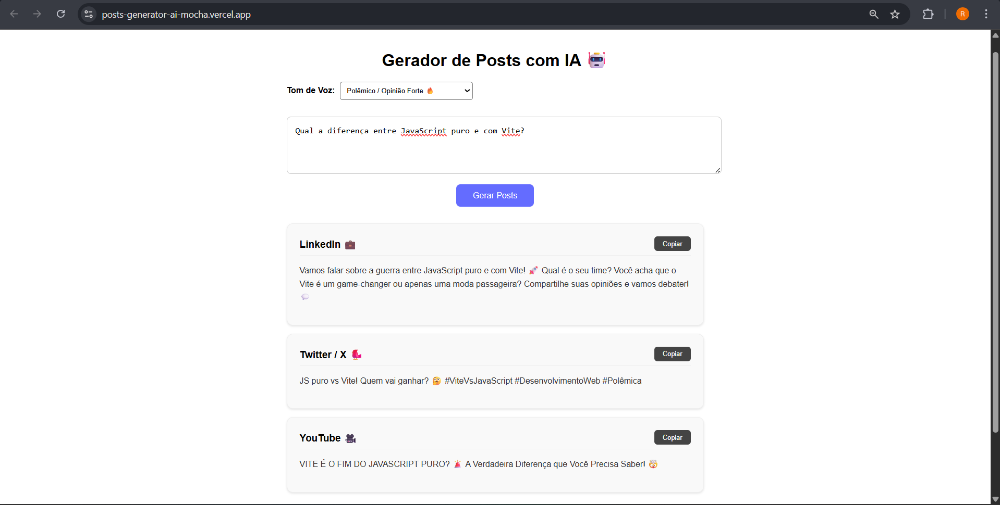

# 🤖 Gerador de Posts com IA 

Uma aplicação **Full Stack** que utiliza Inteligência Artificial para criar conteúdo otimizado para múltiplas redes sociais (LinkedIn, Twitter/X e YouTube) a partir de um único tema.

> **Status do Projeto:** 🚀 Em Produção (Deploy na Vercel)
> 🔗 **Acesse aqui:** https://posts-generator-ai-mocha.vercel.app

## 📸 Preview


## 🛠️ Tecnologias Utilizadas

Este projeto foi desenvolvido com uma arquitetura desacoplada (Decoupled Architecture) focada em escalabilidade e engenharia de prompt.

* **Front-end:** React.js + Vite (SPA Responsiva)
* **Back-end / Orquestração:** n8n (Workflow Automation)
* **Inteligência Artificial:** Llama 3 (via Groq API) para inferência ultra-rápida.
* **Deploy:** Vercel (Front-end) + Instância Self-Hosted/Cloud (n8n).

## 🧠 Engenharia & Funcionalidades

### 1. Injeção de Contexto (Context Injection)
Diferente de um chat comum, esta aplicação injeta parâmetros de sistema no prompt da LLM. O usuário pode selecionar o **Tom de Voz** (Engraçado, Polêmico, Corporativo), e o Front-end envia esse metadado para o Back-end adaptar a resposta.

### 2. Tratamento de Dados (Parsing)
* O n8n recebe o JSON cru da IA.
* Um nó de **Javascript Code** limpa marcadores Markdown e formata a string em um Objeto JSON válido.
* O Front-end recebe dados estruturados, prevenindo erros de renderização.

### 3. Usabilidade (UX)
* Interface limpa e focada.
* Botões de "Copy to Clipboard" integrados com a API do navegador.
* Feedback visual de carregamento e sucesso.

## 🚀 Como Rodar Localmente

### Pré-requisitos
* Node.js instalado.
* Uma instância do n8n rodando (Local ou Cloud).
* Chave de API da Groq (Grátis).

### Instalação

1.  Clone o repositório:
    ```bash
    git clone https://github.com/DamasoRafael/posts-generator-ai.git
    ```
2.  Instale as dependências:
    ```bash
    cd nome-do-projeto
    npm install
    ```
3.  Execute o servidor de desenvolvimento:
    ```bash
    npm run dev
    ```

---
Desenvolvido por **Rafael Damaso** 💻
[LinkedIn](https://www.linkedin.com/in/rafael-damaso-26b678284/) | [GitHub](https://github.com/DamasoRafael)